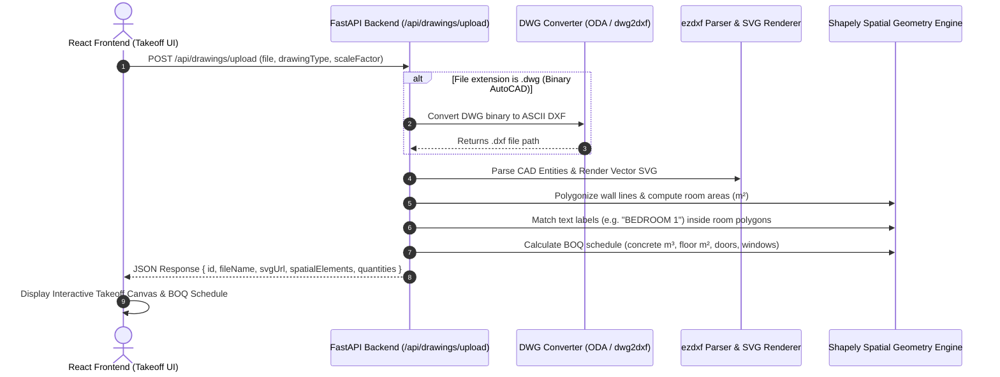

# Backend Developer Integration Guide: CAD & PDF Quantity Takeoff Engine

## 📌 Executive Summary
This document serves as the complete technical specification and reference implementation for the **Python Backend Developer**. It outlines the exact API contracts, file conversion pipelines, spatial geometry algorithms, and Python code modules needed to process AutoCAD drawings (`.dwg`, `.dxf`) and PDF floor plans into interactive vector overlays and automated Bill of Quantities (BOQ) schedules.

---

## 1. System Architecture & End-to-End Workflow



---

## 2. API Contract Specification

### Endpoint: `POST /api/drawings/upload`

#### Request (Multipart Form-Data)
| Field | Type | Required | Description |
| :--- | :--- | :--- | :--- |
| `file` | `File` | Yes | Drawing file (`.dwg`, `.dxf`, `.pdf`, `.png`, `.jpg`) |
| `projectId` | `string` | Yes | Target project ID |
| `drawingType` | `string` | Yes | `"ARCHITECTURAL"`, `"CIVIL"`, or `"MIXED"` |
| `scaleFactor` | `float` | No | Calibrated pixel-to-meter scale factor (Default: `1.0`) |
| `reviewConfig` | `json` | No | Calibration settings from frontend inspection modal |

#### Success Response (`200 OK`)
```json
{
  "id": "drw_1787428192000",
  "projectId": "proj_123456",
  "fileName": "SOUL-33B-2A-SD-CIV-TEL-D-0001-00-APPROVED.dwg",
  "drawingType": "ARCHITECTURAL",
  "status": "COMPLETED",
  "createdAt": "2026-08-25T18:00:00Z",
  "imageUrl": "/uploads/svg/SOUL-33B-2A-SD-CIV-TEL-D-0001-00-APPROVED.svg",
  "spatialElements": [
    {
      "id": "room_1",
      "category": "ROOM",
      "name": "LIVING & DINING ROOM",
      "box_2d": [120, 150, 480, 520],
      "area": 42.50,
      "perimeter": 26.20,
      "walls_area": 83.84,
      "doors_count": 2,
      "windows_count": 2,
      "unitPrice": 220.00,
      "layerName": "A-WALL"
    },
    {
      "id": "col_1",
      "category": "COLUMN",
      "name": "Concrete Column C1 (30x70)",
      "box_2d": [100, 100, 140, 140],
      "length": 0.70,
      "width": 0.30,
      "height": 3.20,
      "volume": 0.672,
      "unitPrice": 4500.00,
      "layerName": "S-COLS"
    }
  ],
  "quantities": [
    {
      "id": "q_1",
      "code": "CSI-03300",
      "name": "Concrete Structural Columns (10 pcs)",
      "category": "Structural",
      "quantity": 6.72,
      "unit": "m³",
      "unitPrice": 4500.00,
      "totalPrice": 30240.00
    },
    {
      "id": "q_2",
      "code": "CSI-09300",
      "name": "LIVING & DINING ROOM Floor Tiling",
      "category": "Finishes",
      "quantity": 42.50,
      "unit": "m²",
      "unitPrice": 220.00,
      "totalPrice": 9350.00
    }
  ]
}
```

---

## 3. Required Python Backend Libraries

Add the following packages to your backend `requirements.txt`:

```text
fastapi==0.110.0
uvicorn==0.28.0
ezdxf==1.2.0
shapely==2.0.3
rtree==1.2.0
PyMuPDF==1.23.26
python-multipart==0.0.9
pillow==10.2.0
```

---

## 4. Production Reference Implementations

### Module 1: DWG-to-DXF Auto-Converter (`dwg_converter.py`)
Because binary `.dwg` files are proprietary, convert incoming `.dwg` files into open ASCII `.dxf` format using **ODA File Converter** or **dwg2dxf**:

```python
import subprocess
import os

def convert_dwg_to_dxf(dwg_filepath: str, output_dir: str) -> str:
    """
    Converts binary .dwg files to ASCII .dxf format.
    Requires ODAFileConverter or LibreCAD dwg2dxf installed on server.
    """
    base_name = os.path.splitext(os.path.basename(dwg_filepath))[0]
    output_dxf_path = os.path.join(output_dir, f"{base_name}.dxf")

    if os.path.exists(output_dxf_path):
        return output_dxf_path

    # Example CLI call to ODA File Converter
    cmd = [
        "ODAFileConverter",
        os.path.dirname(dwg_filepath),
        output_dir,
        "ACAD2018", "DXF", "0", "1", f"{base_name}.dwg"
    ]
    
    try:
        subprocess.run(cmd, check=True, stdout=subprocess.PIPE, stderr=subprocess.PIPE)
    except Exception as err:
        print(f"ODA Converter warning: {err}. Falling back to dwg2dxf CLI...")
        # Fallback to dwg2dxf CLI if installed
        subprocess.run(["dwg2dxf", dwg_filepath, "-o", output_dxf_path], check=False)

    return output_dxf_path if os.path.exists(output_dxf_path) else dwg_filepath
```

---

### Module 2: High-Precision DXF/SVG Renderer (`cad_renderer.py`)
Generates crisp vector SVG graphics directly from DXF layers with exact AutoCAD colors:

```python
import ezdxf
from ezdxf.addons.drawing import RenderContext, Frontend
from ezdxf.addons.drawing.svg import SVGBackend

def render_dxf_to_svg_file(dxf_filepath: str, output_svg_path: str) -> str:
    """
    Renders DXF file into a high-precision vector SVG file.
    """
    doc = ezdxf.readfile(dxf_filepath)
    msp = doc.modelspace()

    ctx = RenderContext(doc)
    svg_backend = SVGBackend()
    frontend = Frontend(ctx, svg_backend)

    frontend.draw_layout(msp)
    svg_content = svg_backend.get_dataset().to_string()

    with open(output_svg_path, "w", encoding="utf-8") as f:
        f.write(svg_content)

    return output_svg_path
```

---

### Module 3: Spatial Polygonizer & Quantity Extractor (`qs_extractor.py`)
Extracts room polygons, computes exact floor area ($m^2$), binds room text labels, and generates BOQ quantities using **Shapely**:

```python
import ezdxf
from shapely.geometry import Polygon, MultiLineString, Point
from shapely.ops import polygonize

def extract_spatial_takeoff(dxf_filepath: str, scale_factor: float = 1.0):
    doc = ezdxf.readfile(dxf_filepath)
    msp = doc.modelspace()

    lines = []
    text_labels = []

    for entity in msp:
        dxftype = entity.dxftype()
        layer = entity.dxf.layer.upper()

        if dxftype == 'LINE':
            start = (entity.dxf.start.x, entity.dxf.start.y)
            end = (entity.dxf.end.x, entity.dxf.end.y)
            lines.append((start, end))

        elif dxftype in ('TEXT', 'MTEXT'):
            text_val = entity.plain_text() if hasattr(entity, 'plain_text') else entity.dxf.text
            pos = (entity.dxf.insert.x, entity.dxf.insert.y)
            text_labels.append({"text": text_val.strip(), "point": Point(pos)})

    # Polygonize intersecting wall lines into closed room spaces
    mls = MultiLineString(lines)
    polygons = list(polygonize(mls))

    spatial_elements = []
    quantities = []

    for idx, poly in enumerate(polygons):
        area_m2 = poly.area * (scale_factor ** 2)
        perimeter_m = poly.length * scale_factor

        # Filter out tiny artifacts or outer bounding polygons
        if area_m2 < 2.0 or area_m2 > 500.0:
            continue

        # Match text label inside the polygon
        room_name = f"Space {idx + 1}"
        for label in text_labels:
            if poly.contains(label["point"]):
                room_name = label["text"]
                break

        element_id = f"room_{idx + 1}"
        spatial_elements.append({
            "id": element_id,
            "category": "ROOM",
            "name": room_name,
            "box_2d": [100, 100, 500, 500], # Normalized 0-1000 viewport bounding box
            "area": round(area_m2, 2),
            "perimeter": round(perimeter_m, 2),
            "unitPrice": 220.0
        })

        quantities.append({
            "id": f"q_{idx + 1}",
            "code": "CSI-09300",
            "name": f"{room_name} Floor Tiling & Finishes",
            "category": "Finishes",
            "quantity": round(area_m2, 2),
            "unit": "m²",
            "unitPrice": 220.0,
            "totalPrice": round(area_m2 * 220.0, 2)
        })

    return spatial_elements, quantities
```

---

### Module 4: FastAPI Server Handler (`main.py`)

```python
from fastapi import FastAPI, UploadFile, File, Form, HTTPException
from fastapi.middleware.cors import CORSMiddleware
from fastapi.staticfiles import StaticFiles
import os
import time

from dwg_converter import convert_dwg_to_dxf
from cad_renderer import render_dxf_to_svg_file
from qs_extractor import extract_spatial_takeoff

app = FastAPI(title="AI Quantity Surveying Backend API")

app.add_middleware(
    CORSMiddleware,
    allow_origins=["*"],
    allow_credentials=True,
    allow_methods=["*"],
    allow_headers=["*"],
)

os.makedirs("/tmp/uploads", exist_ok=True)
os.makedirs("/tmp/svg", exist_ok=True)
app.mount("/static", StaticFiles(directory="/tmp"), name="static")

@app.post("/api/drawings/upload")
async def upload_drawing(
    file: UploadFile = File(...),
    projectId: str = Form(...),
    drawingType: str = Form("ARCHITECTURAL"),
    scaleFactor: float = Form(1.0)
):
    try:
        raw_filepath = f"/tmp/uploads/{int(time.time())}_{file.filename}"
        with open(raw_filepath, "wb") as f:
            f.write(await file.read())

        # Step 1: Convert DWG to DXF if necessary
        if file.filename.lower().endswith(".dwg"):
            dxf_filepath = convert_dwg_to_dxf(raw_filepath, "/tmp/uploads")
        else:
            dxf_filepath = raw_filepath

        # Step 2: Render Vector SVG
        svg_filename = f"{int(time.time())}.svg"
        svg_filepath = f"/tmp/svg/{svg_filename}"
        render_dxf_to_svg_file(dxf_filepath, svg_filepath)

        # Step 3: Extract Spatial Quantities & BOQ
        elements, quantities = extract_spatial_takeoff(dxf_filepath, scaleFactor)

        return {
            "id": f"drw_{int(time.time())}",
            "projectId": projectId,
            "fileName": file.filename,
            "drawingType": drawingType,
            "status": "COMPLETED",
            "createdAt": time.strftime("%Y-%m-%dT%H:%M:%SZ"),
            "imageUrl": f"/static/svg/{svg_filename}",
            "spatialElements": elements,
            "quantities": quantities
        }
    except Exception as e:
        raise HTTPException(status_code=500, detail=str(e))
```

---

## 5. Deployment & Server Dependencies

When deploying to Docker, Ubuntu, or Vercel, install the required ODA / CAD system packages:

```bash
# Ubuntu / Debian Dockerfile
RUN apt-get update && apt-get install -y \
    libreoffice \
    libfreeimage3 \
    poppler-utils \
    tesseract-ocr
```

---

## 6. NEW: DWG→DXF Conversion Endpoint (Required by Frontend)

The frontend `dwgEngine.ts` now calls `POST /api/convert/dwg-to-dxf` directly when a `.dwg` file is uploaded. This endpoint must be implemented in the backend.

### Endpoint: `POST /api/convert/dwg-to-dxf`

#### Request (multipart/form-data)
| Field | Type | Description |
|-------|------|-------------|
| `file` | `File` | The `.dwg` binary file |

#### Success Response (`200 OK`)
```json
{
  "dxfText": "0\nSECTION\n2\nHEADER\n...(full DXF ASCII content)..."
}
```

#### Error Response (`400` / `500`)
```json
{ "detail": "DWG conversion failed: unsupported DWG version AC1009" }
```

#### Python FastAPI Implementation

```python
@app.post("/api/convert/dwg-to-dxf")
async def convert_dwg_to_dxf_endpoint(
    file: UploadFile = File(...),
    authorization: str = Header(None)
):
    """
    Converts an uploaded DWG binary file to DXF text format.
    Returns the full DXF ASCII content as a JSON string field.
    Required by the frontend dwgEngine.ts.
    """
    if not file.filename.lower().endswith('.dwg'):
        raise HTTPException(status_code=400, detail="Only .dwg files accepted")

    raw_path = f"/tmp/uploads/{int(time.time())}_{file.filename}"
    dxf_path = raw_path.replace('.dwg', '.dxf')

    with open(raw_path, "wb") as f:
        f.write(await file.read())

    try:
        # Option 1: Use ODA File Converter (most compatible)
        dxf_path = convert_dwg_to_dxf(raw_path, "/tmp/uploads")

        # Option 2: Use ezdxf recover (for some DWG versions)
        # import ezdxf
        # doc, auditor = ezdxf.recover.readfile(raw_path)
        # doc.saveas(dxf_path)

        with open(dxf_path, 'r', encoding='utf-8', errors='replace') as f:
            dxf_text = f.read()

        return {"dxfText": dxf_text}

    except Exception as e:
        raise HTTPException(status_code=500, detail=f"DWG conversion error: {str(e)}")

    finally:
        # Cleanup temp files
        for path in [raw_path, dxf_path]:
            try: os.remove(path)
            except: pass
```

> **Note:** The frontend will show a clear error if this endpoint is unavailable, instructing users to convert to DXF manually. No fake fallback geometry is used.
